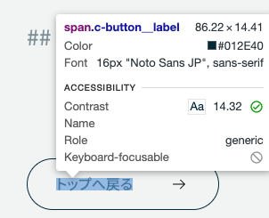
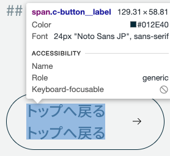

最近Figmaでデザインをもらうと、ちらほら Vertical-trim をしている（正しい表現か不明）デザインに当たることがある。テキストのline-heightに応じて上下余白が増えたりするアレである。

今に始まったことではないのですが、昔調べた時はネガティブマージンで打ち消すか、なんとなく見た目が同じ様になるように上下余白をデザインの値から調整して設定していました。

久しぶりに調べてみた結果、[CSSの実装は追いついておらず](https://caniuse.com/?search=leading-trim)簡単に消せるのは先になりそうです。

ざっと調べた感じ、従来通りBefore, Afterで打ち消すか下記のライブラリを使うのが良さそうでした。

[https://seek-oss.github.io/capsize/](https://seek-oss.github.io/capsize/)

結局実務ではBefore, Afterで消す方を採用しました、文字の大きさによっては数pxズレるケースがありますが概ね意図したとおりに消せるので9割満足です。

書体によって打ち消す割合が変動するので、使用する書体に応じて少々調整が必要です。

下記は Noto sans JP に最適化した例です。

```
@mixin trim($line-height: 2) {
	&::before {
		content: "";
		display: table;
		margin-bottom: calc((1 - #{$line-height}) * 0.6em); // Noto sans JP の場合、0.5だと上余白が若干残る
	}
	&::after {
		content: "";
		display: table;
		margin-top: calc((1 - #{$line-height}) * 0.5em);
	}
}
```

目視でなんとなく合わせたので厳密では無いですが「まあまあ」でよければ使い勝手は良い印象でした。

例）line-height: 2; font-size: 16px;



例）line-height: 1.5; font-size: 24px;



## 【2024/11/5 追記】記述が簡易になりました。

単位lh が実戦投入できそうな感じになったのでline-heightを知る必要がなくなりました。すっきりしましたね。

参考） [https://www.tak-dcxi.com/article/use-line-height-trim-as-css-variable/](https://www.tak-dcxi.com/article/use-line-height-trim-as-css-variable/)

```
--leading-trim: calc((1em - 1lh) / 2);

@mixin leading-trim {
	&::before,
	&::after {
		content: "";
		display: block flow;
		inline-size: 0;
		block-size: 1px;
	}

	&::before {
		margin-block-end: var(--leading-trim);
	}

	&::after {
		margin-block-start: var(--leading-trim);
	}
}
```
