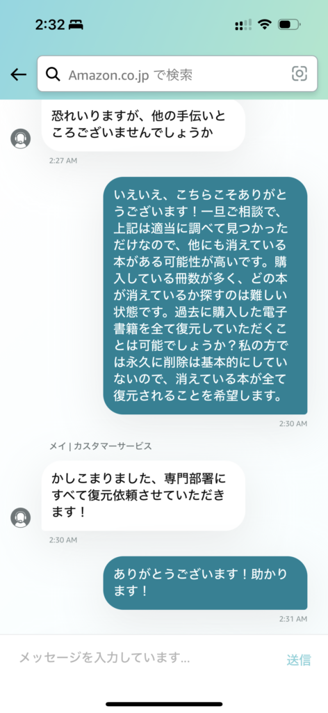

以前購入済みの本がちらほら消えている状態に気づきました。

[/blog/book-disappeared-from-kindle/](/blog/book-disappeared-from-kindle/)

> ただ、消えた/消した本がこの1冊だけなのかどうかはわからないので、それはお客様の方で調べて欲しいとのことでした。
> 
> もし他に消えてる本があっても読みたくなった時に気づくだろう、、気づかなければ仕方なし。ということで一旦この件はおしまい。

この後案の定何冊か消えている本が何冊か見つかり、どうしよ・・・状態になりました。

この時点で蔵書は3,000冊を超えているので目視での確認は絶望的でした。完全な蔵書の履歴が「注文履歴」しかなく、スクレイピングしたとして一致させるの難しくないか？と詰みに近い感じです。

サポート側で取れる手段が再配信のみっぽいので、とにかく全て戻してくれって頼んでみるか、とダメ元でお願いしてみることにしました。

いけた！！！

正直この時点では「ほんまか・・・？」と思っていましたが無事一週間ほどでライブラリの蔵書が増えていることを確認できました。（100冊くらい増えた）
