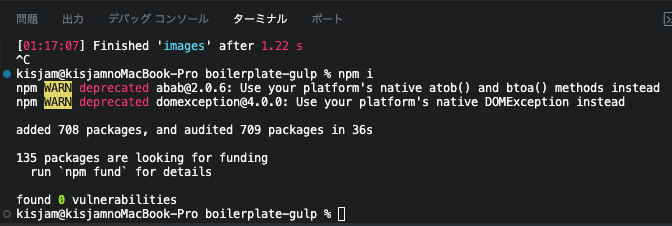

完全にメンテが終わったと思っていたGulpにアップデートがはいりました 🎉

ここ数年メンテがなかったので「そろそろgulpなしでタスクランナー動くように整備するか」と時間を見つけて移行作業をしていた矢先だったので悩ましいところではありましたが、進行中の案件等で使用する機会があるため念の為更新することにしました。

[https://github.com/gulpjs/gulp/releases/tag/v5.0.0](https://github.com/gulpjs/gulp/releases/tag/v5.0.0)

メジャーバージョンのアップデートでしたが、特に既存のタスクに修正無くそのまま動いた印象です。

ついでにVulnerability 0にしとくか〜と思い、 エラー吐きまくってる `imagemin` の代わりに `Sharp` を画像最適化のタスクに設定しました。

地味に躓いたポイントとして、Sharpで画像を読み込んだ際に \`Error: Input buffer contains unsupported image format\` のエラーが発生したので備忘録としてまとめます。

vinyl-fsの仕様で `encoding: false` じゃないとバイナリデータを返してくれないようです。

> [](https://github.com/gulpjs/vinyl-fs#optionsencoding)Optionally transcode from the given encoding. The default is `'utf8'`. We use [iconv-lite](https://github.com/ashtuchkin/iconv-lite), please refer to its Wiki for a list of supported encodings. You can set this to `false` to avoid any transcoding, and effectively just pass around raw binary data.
> 
> https://github.com/gulpjs/vinyl-fs

```
.src(dir.src.images + "**/*.{jpg,png,webp,svg,gif}", {
	encoding: false,
})
```

上記のように修正したら無事動きました。



めでたく0 Vulnerability！

一応画像最適化タスクの実装を最後に添付します（適当です）

```
import path from "node:path";
import gulp from "gulp";
import changed from "gulp-changed";
import plumber from "gulp-plumber";
import browserSync from "browser-sync";
import through2 from "through2";
import sharp from "sharp";
import { dir } from "../config.mjs";

const images = () => {
	return gulp
		.src(dir.src.images + "**/*.{jpg,png,webp,svg,gif}", {
			encoding: false,
		})
		.pipe(plumber())
		.pipe(changed(dir.build.images, { extension: ".webp" }))
		.pipe(
			through2.obj(function (file, _, cb) {
				if (
					file.isNull() ||
					file.isDirectory() ||
					path.extname(file.path).toLowerCase() === ".webp" ||
					path.extname(file.path).toLowerCase() === ".svg" ||
					path.extname(file.path).toLowerCase() === ".gif"
				) {
					cb(null, file);
					return;
				}

				sharp(file.contents)
					.webp()
					.toBuffer()
					.then((data) => {
						file.contents = data;
						file.path = path.join(
							path.dirname(file.path),
							path.basename(file.path, path.extname(file.path)) + ".webp"
						);

						return cb(null, file);
					})
					.catch((err) => cb(err));
			})
		)
		.pipe(gulp.dest(dir.build.images))
		.pipe(browserSync.stream());
};

export default images;
```
